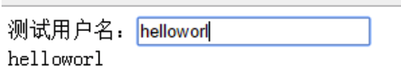

ES6的改版，主要是通过引入JAVA等静态语言的优秀思想来解决老版本的一些痼疾，如作用域，回调，继承和封装等问题。这些改革措施是非常成功的，ES6让JS真正变成了一种好用的语言。


<!-- more -->

# 搞定变量作用域问题：let
ES5时代的囧境就是把某个变量搞成了全局变量，加上文件之间的相互调用，我们不容易追踪到它到底是在哪里被修改掉的。
es6引入了let这个关键字，问题得到了解决：
```h
let i=100;
//循环语句1
for(let i=0;i<10;i++){}
console.log(i);//100
//循环语句2
while(true){
    let i=11;
    break;
}
console.log(i);//100
//分支语句
if(true){
    let i=111;
}
else{
    let i=0;
}
console.log(i);//100
```
let关键字让变量作用域变得清晰可控
# 利用const，保证全局变量不被更改
有时，我们在某个全局文件下声明了某个变量，而在别人引入这个文件时，有时也会用同样的名字。为了保证这个变量不会被修改，我们就可以用常量来约束一下。
```h
const username = "jack";
//重新声明
var username = 'hello';
//直接修改
username = 123;
console.log(username);
```
# 类的声明与继承
按照静态语有的面向对象思想，我们会把某个功能封装到一个类里面，然后暴露出一些外部访问的接口，以达到`高内聚低耦合`的设计目的。
其实我们在es5时代都是没有类的概念的。类可以声明为一个函数，也可以是个字面量（字面量就是实例化的类），这很容易把人弄迷糊。
而es6引入了静态语言的`class`之后，让类和函数划清了界限，代码整洁度和阅读舒适度都有了显著提升。
```h

class Animal {
//构造函数，注意函数之间不用加;
 constructor(){
  this.type = 'animal';
 }
 says(say){
  console.log(this.type + ' says ' + say);
 }
}

let animal = new Animal();
animal.says('hello'); //animal says hello

class Cat extends Animal {
 constructor(){
 super();//继承了父类的属性和方法
 this.type = 'cat';
 }
}

let cat = new Cat();
cat.says('hello'); //cat says hello
```
# 箭头函数，解决this指向问题
JS的对象间的互相调用是非常繁杂的，一不小心就会遇到this被篡改的问题，导致后面的代码出错。比如这样的情况：
```h

class Animal {
 constructor(){
 this.type = 'animal';
 }
 says(say){
  setTimeout(function(){
   console.log(this.type + ' says ' + say);
  }, 1000);
 }
}

var animal = new Animal();
animal.says('hi'); //undefined says hi
```
这是一个比较经典的this被篡改的问题，因为这个该死的`setTimeout`函数，他的`this`指向的是window对象。
我们可以利用一个变量保存住这个`this`指针，也或者使用`bind(this)`方法，但有了箭头函数，等于函数本身集成了保存this指针的功能。这给我们提供了极大的便利，我们可以把精力放在业务逻辑的实现上，而不是处处提防this的陷阱。
```h
class Animal {
 constructor(){
  this.type = 'animal';
 }
 says(say){
  setTimeout( () => {
   console.log(this.type + ' says ' + say);
  }, 1000);
 }
}
var animal = new Animal();
animal.says('hi'); //animal says hi
```
# 插入大段html文本
这种使用场景非常高。比如我们从服务器请求一个数据过来，然后跟`html`拼接好，最后追加到某个div下。
拼接字符串无疑会打乱html节点本来的结构，各种双引号单引号满天飞，一不留神就会弄错，阅读和维护也很麻烦。
如果能不改变html的结构就好了！于是es6引入了`模板字串`的概念。
```h

<!DOCTYPE html>
<html>
<head lang="en">
<meta charset="UTF-8">
<title></title>
</head>
<body>
<div id="container"></div>
</body>
</html>
<script>
var cont = document.getElementById('container');
//一些变量
var name = 'jack';
var age = 18;
cont.innerHTML =
 `<div style="color:red;">
   <span class="name">${name}</span>
   <b class="age">${age}</b>
  </div>`;
```
在`反引号`中随意使用各种引号，其中的变量都用`${}`来表示。这样代码就变得优雅了。
# 默认值default
有时我们声明了一个函数，可能里面的逻辑比较复杂，需要保证调用时一定传入形参值，否则后面的代码就会报错。
那如何防止其他开发人员就是传空呢？我们要给形参一个默认值。
```h
function hello(name){
 name = name || 'jack';

 console.log(name+' say hello!');
}
hello();
```
但这样写不够直观，es6提供了默认值的写法。
```h
function hello(name ='jack'){
 console.log(name + ' say hello!');
}
hello();
```
# 省略号语法
省略号是一种语法糖，在处理函数不定参时十分有用。
像下面这个例子，无论传入几个参数，它都会将剩余的参数打成数组。
```h
function hello(a,b,...others){
console.log(others);//[ 'amily', 'mike', 'sam' ]
}
hello('jack','tom','amily','mike','sam');
```
# Object几个好用的扩展
> Object是JS最根上的类。在JS中造的任何东西都脱胎于他。他相当于万物之本，是上帝。这个上帝类，在es6也得到了功能扩充。

- 1.`assign()`方法：用于对象的合并或拷贝。
```h
//对象合并
var target = {a:1};
var source = {b:2};
Object.assign(target,source);
console.log(target);//{a: 1, b: 2}
```
> 注意，拷贝是浅拷贝，而不是深拷贝。

```h
//对象拷贝，是浅拷贝。
let target = { a: { b: 'hello'} };
let source = { c: { d: 'world' } };
Object.assign(target, source);
console.log(target);//{ a: { b: 'hello' }, c: { d: 'world' } }
target.c.d = 'haha';
console.log(source);//{ c: { d: 'haha' } }
```
如果是深拷贝，target改变了，source不应跟着改变；浅拷贝相反。
究竟是用哪种拷贝，得看实际应用场景。

- 2.`defineProperty()`方法：双向绑定的秘密！

在angular或vue等框架里，对双向绑定并不陌生。
数据和视图的联动真的很酷，能解决很多现实问题，但这个究竟如何实现的呢？
我们可以通过这个es6新提供的方法轻松搞定它。
先来看一下用法：
```h
Object.defineProperty(obj, prop, descriptor) 
obj：待修改的对象。
prop：待修改的属性名称。
descriptor：待修改属性的相关描述，要求传入一个对象。
{
    configurable: false,
    enumerable: false,
    writable: false,
    value: '',
    set: function(){},
    get: function(){}
}


- configurable：属性是否可配置。可配置的含义包括：是否可以删除属性（ delete ），是否可以修改属性的 writable 、 enumerable 属性。
- enumerable：属性是否可遍历出来（可通过 for...in 遍历到）。
- writable：属性是否可重写（是否可以对属性进行重新赋值？）
- value：属性的默认值。
- set：属性的重写方法。一旦属性被重新赋值，此方法被自动调用。
- get ：属性的读取方法。一旦属性被访问读取，此方法被自动调用。
```
看个例子：
```h
var obj = {};
//给obj对象赋予了一个属性name，值为jack
Object.defineProperty(obj, 'name', {
 value: 'jack'
});
//给obj对象赋予了一个属性age，值为100
Object.defineProperty(obj, 'age', {
 value: 100,
 configurable: true,//可配置
 enumerable: true,//可遍历出来
 writable: true//可写
});

console.log(obj.age); // 100

obj.age = 18;//重写
console.log(obj.age); // 18. 因为age属性是可重写的
//遍历obj
for(let key in obj){
 console.log(key+":"+obj[key]);//age:18，默认是不可配置的，所以name读不到
}
//给obj对象赋予了一个属性sex，值为male
Object.defineProperty(obj, 'sex', {
 value: 'male',
 writable: false
});

obj.sex = 'female'; // 不可重写
console.log(obj.sex); // 'male'

delete obj.sex; // 属性删除无效，默认是不可配置的

console.log(obj.sex);// 'male'，依然可以读出

Object.defineProperty(obj, 'weight', {
//value: '75kg',//如果打开这个value就会报错
 set: function(str) {
console.log('set weight',str);
},
 get:function(){
console.log('get weight');
}
});
```
需要注意的是，set和get方法跟value属性是互斥的，同时出现会报错。
下面就来看一下如何实现一个数据和视图双向绑定效果。
```h
<!DOCTYPE html>
<html>
<head lang="en">
<meta charset="UTF-8">
<title>数据和视图联动</title>

</head>
<body>
<div>
<div>测试用户名：<input type="text" id='userName'/></div>
<div id="show"></div>
</div>　　　
</body>
</html>
<script>
var userInfo = {};
Object.defineProperty(userInfo, "userName", {
 get: function(){
  return document.getElementById('show').innerHTML;
 },
 set: function(name){
  document.getElementById('show').innerHTML = name;
 }
});

document.getElementById('userName').onkeyup = function(e){
//改变数据，触发set方法，从而改变了视图。
 userInfo.userName = this.value;
};
</script>
```
运行效果：


- 3.对象简写
es6提供了对象的简洁写法。虽然属性和方法都可以简写，但我觉得属性还是规规矩矩写键值对就好，不过方法的简写倒是省事不少。我们看一下如何书写：
```h
var obj = {
 name:'jack',
 age:18,
 method() {
   return this.name+'--'+this.age;
 }
};
console.log(obj.method());
```
