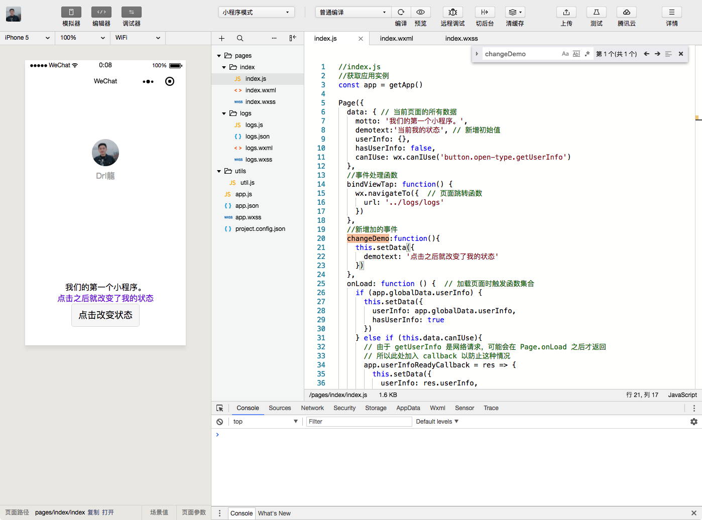
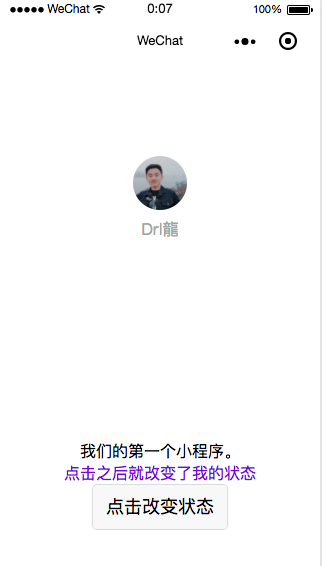
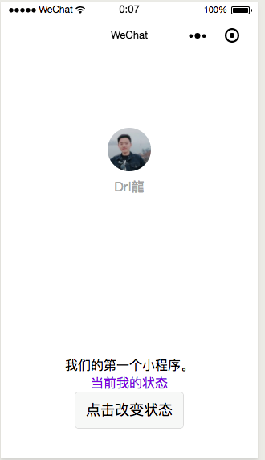

小程序是一种新的开放能力，开发者可以快速地开发一个小程序。小程序可以在微信内被便捷地获取和传播，同时具有出色的使用体验。


<!-- more -->

# 目录结构

* page --- 项目所有的页面模板
* utils --- 公共js工具
* app.js --- 启动入口文件
* app.wxss --- 项目的全局样式文件
* app.json --- 项目的配置文件

在`app.json`里我们可以看到`page`下面就是我们可以配置的页面路径，`pages/index/index`这个路径就可以访问`index.wxml`下的东西，每一个页面都有“三大件”---`js、wxml、wxss`组成。


下面开始我们小栗子：

新增一个view，`wxml`与`wxss`就是我们的HTML和css,需要增加和修改样式的话就直接修改就好了。

```h
<!--index.wxml-->
<view class="container">
  <view class="userinfo">
    <button wx:if="{{!hasUserInfo && canIUse}}" open-type="getUserInfo" bindgetuserinfo="getUserInfo"> 获取头像昵称 </button>
    <block wx:else>
      <image bindtap="bindViewTap" class="userinfo-avatar" src="{{userInfo.avatarUrl}}" background-size="cover"></image>
      <text class="userinfo-nickname">{{userInfo.nickName}}</text>
    </block>
  </view>
  <view class="usermotto">
    <text class="user-motto">{{motto}}</text>
  </view>
  <view>
    <text class="demo">这是一个测试小栗子</text>
  </view>
</view>
```

```h
/**index.wxss**/
.userinfo {
  display: flex;
  flex-direction: column;
  align-items: center;
}

.userinfo-avatar {
  width: 128rpx;
  height: 128rpx;
  margin: 20rpx;
  border-radius: 50%;
}

.userinfo-nickname {
  color: #aaa;
}

.usermotto {
  margin-top: 200px;
}
/*新增加的  */
.demo{
  color:blueviolet
}
```
保存好就可以看到效果了。
接下来我们试一下动态改变内容，先来介绍下js文件下的一些函数模块是什么意思：
```h
//index.js
//获取应用实例
const app = getApp()

Page({
  data: { // 当前页面的所有数据
    motto: '我们的第一个小程序。',
    userInfo: {},
    hasUserInfo: false,
    canIUse: wx.canIUse('button.open-type.getUserInfo')
  },
  //事件处理函数
  bindViewTap: function() {
    wx.navigateTo({  // 页面跳转函数
      url: '../logs/logs'
    })
  },
  onLoad: function () {  // 加载页面时触发函数集合
    if (app.globalData.userInfo) {
      this.setData({
        userInfo: app.globalData.userInfo,
        hasUserInfo: true
      })
    } else if (this.data.canIUse){
      // 由于 getUserInfo 是网络请求，可能会在 Page.onLoad 之后才返回
      // 所以此处加入 callback 以防止这种情况
      app.userInfoReadyCallback = res => {
        this.setData({
          userInfo: res.userInfo,
          hasUserInfo: true
        })
      }
    } else {
      // 在没有 open-type=getUserInfo 版本的兼容处理
      wx.getUserInfo({
        success: res => {
          app.globalData.userInfo = res.userInfo
          this.setData({
            userInfo: res.userInfo,
            hasUserInfo: true
          })
        }
      })
    }
  },
  getUserInfo: function(e) { //获取用户信息
    console.log(e)
    app.globalData.userInfo = e.detail.userInfo
    this.setData({
      userInfo: e.detail.userInfo,
      hasUserInfo: true
    })
  }
})

```
具体函数对应含义也可以参考[微信公众平台开发](https://developers.weixin.qq.com/miniprogram/dev/api/open.html#wxgetuserinfoobject)。

先去wxml文件下增加一个按`<button class='primary' bindtap='changeDemo'>点击改变状态</button>`,接着去js文件下添加初始数据，和点击的事件函数。
```h
<!--index.wxml-->
<view class="container">
  <view class="userinfo">
    <button wx:if="{{!hasUserInfo && canIUse}}" open-type="getUserInfo" bindgetuserinfo="getUserInfo"> 获取头像昵称 </button>
    <block wx:else>
      <image bindtap="bindViewTap" class="userinfo-avatar" src="{{userInfo.avatarUrl}}" background-size="cover"></image>
      <text class="userinfo-nickname">{{userInfo.nickName}}</text>
    </block>
  </view>
  <view class="usermotto">
    <text class="user-motto">{{motto}}</text>
  </view>
  <view>
    <text class="demo">{{demotext}}</text>
  </view>
  <button class='primary' bindtap='changeDemo'>点击改变状态</button>

</view>
```
```h
//index.js
//获取应用实例
const app = getApp()

Page({
  data: { // 当前页面的所有数据
    motto: '我们的第一个小程序。',
    demotext:'当前我的状态', // 新增初始值
    userInfo: {},
    hasUserInfo: false,
    canIUse: wx.canIUse('button.open-type.getUserInfo')
  },
  //事件处理函数
  bindViewTap: function() {
    wx.navigateTo({  // 页面跳转函数
      url: '../logs/logs'
    })
  },
  //新增加的事件
  changeDemo:function(){
    this.setDate({
      demotext: '点击之后就改变了我的状态',
    })
  },
  onLoad: function () {  // 加载页面时触发函数集合
    if (app.globalData.userInfo) {
      this.setData({
        userInfo: app.globalData.userInfo,
        hasUserInfo: true
      })
    } else if (this.data.canIUse){
      // 由于 getUserInfo 是网络请求，可能会在 Page.onLoad 之后才返回
      // 所以此处加入 callback 以防止这种情况
      app.userInfoReadyCallback = res => {
        this.setData({
          userInfo: res.userInfo,
          hasUserInfo: true
        })
      }
    } else {
      // 在没有 open-type=getUserInfo 版本的兼容处理
      wx.getUserInfo({
        success: res => {
          app.globalData.userInfo = res.userInfo
          this.setData({
            userInfo: res.userInfo,
            hasUserInfo: true
          })
        }
      })
    }
  },
  getUserInfo: function(e) { //获取用户信息
    console.log(e)
    app.globalData.userInfo = e.detail.userInfo
    this.setData({
      userInfo: e.detail.userInfo,
      hasUserInfo: true
    })
  }
})
```




在wxml文件里加入`if-else`的判断：
```h
<!--index.wxml-->
<view class="container">
  <view class="userinfo">
    <button wx:if="{{!hasUserInfo && canIUse}}" open-type="getUserInfo" bindgetuserinfo="getUserInfo"> 获取头像昵称 </button>
    <block wx:else>
      <image bindtap="bindViewTap" class="userinfo-avatar" src="{{userInfo.avatarUrl}}" background-size="cover"></image>
      <text class="userinfo-nickname">{{userInfo.nickName}}</text>
    </block>
  </view>
  <view class="usermotto">
    <text class="user-motto">{{motto}}</text>
  </view>
  <view>
    <text wx:if="{{demotext=='当前我的状态'}}" class="demo">{{demotext}}</text>
    <text wx:else class="demo">{{demovalue}}</text>
  </view>
  <button class='primary' bindtap='changeDemo'>点击改变状态</button>

</view>
```
```h
// index.js

Page({
  data: { // 当前页面的所有数据
    motto: '我们的第一个小程序。',
    demotext:'当前我的状态', // 新增初始值
    demovalue:'if判断的数据',
    userInfo: {},
    hasUserInfo: false,
    canIUse: wx.canIUse('button.open-type.getUserInfo')
  },
 })
```

接下来是`for`循环遍历数据：
```h
<!--index.wxml-->
<view class="container">
  <view class="userinfo">
    <button wx:if="{{!hasUserInfo && canIUse}}" open-type="getUserInfo" bindgetuserinfo="getUserInfo"> 获取头像昵称 </button>
    <block wx:else>
      <image bindtap="bindViewTap" class="userinfo-avatar" src="{{userInfo.avatarUrl}}" background-size="cover"></image>
      <text class="userinfo-nickname">{{userInfo.nickName}}</text>
    </block>
  </view>
  <view class="usermotto">
    <text class="user-motto">{{motto}}</text>
  </view>
  <view>
    <text wx:if="{{demotext=='当前我的状态'}}" class="demo">{{demotext}}</text>
    <text wx:else class="demo">{{demovalue}}</text>
  </view>
  <button class='primary' bindtap='changeDemo'>点击改变状态</button>
  <view wx:for="{{fordata}}" wx:for-index="id" wx:for-item="itemvalue">
    ID:{{id}}姓名：{{itemvalue.name}}----数量：{{itemvalue.num}}
  </view>
</view>
```
```h
// index.js

Page({
  data: { // 当前页面的所有数据
    motto: '我们的第一个小程序。',
    demotext:'当前我的状态', // 新增初始值
    demovalue:'if判断的数据',
    fordata: [{ name: '测试1', num: 12 }, { name: '测试2', num: 22 }, { name: '测试3', num: 32 }],
    userInfo: {},
    hasUserInfo: false,
    canIUse: wx.canIUse('button.open-type.getUserInfo')
  },
 })
```
本地数据都没有问题了，那么接下来就是`Ajax 跨域请求`,在小程序里面我们不用考虑那么多，因为他们已经为我们封装了一套方法，我们只需要调用就好了，参考发起网络请求[wx.request(OBJECT)](https://developers.weixin.qq.com/miniprogram/dev/api/network-request.html#wxrequestobject)

示例代码：
```h
wx.request({
  url: 'test.php', //仅为示例，并非真实的接口地址
  data: {
     x: '' ,
     y: ''
  },
  header: {
      'content-type': 'application/json' // 默认值
  },
  success: function(res) {
    console.log(res.data)
  }
})
```
最后我们来一个动态获取本地图片上传，使用文档提供的方法获取本地相册[wx.chooseImage(OBJECT)](https://developers.weixin.qq.com/miniprogram/dev/api/media-picture.html#wxchooseimageobject),在js文件里新增一个方法。
```h
onLoad: function () {  // 加载页面时触发函数集合
    var that = this;
    wx.chooseImage({ // 获取本地图片
      count: 1, // 默认9
      sizeType: ['original', 'compressed'], // 可以指定是原图还是压缩图，默认二者都有
      sourceType: ['album', 'camera'], // 可以指定来源是相册还是相机，默认二者都有
      success: function (res) {
        // 返回选定照片的本地文件路径列表，tempFilePath可以作为img标签的src属性显示图片
        var tempFilePaths = res.tempFilePaths
        console.log(tempFilePaths)
        that.setData({
          demoImg: tempFilePaths
        });
      }
    })
}
   
```
wxml文件：
```h
<!--index.wxml-->
<view class="container">
  <view class="userinfo">
    <button wx:if="{{!hasUserInfo && canIUse}}" open-type="getUserInfo" bindgetuserinfo="getUserInfo"> 获取头像昵称 </button>
    <block wx:else>
      <image wx:if="{{demoImg!=null}}" src='{{demoImg}}'></image>
      <image wx:else bindtap="bindViewTap" class="userinfo-avatar" src="{{userInfo.avatarUrl}}" background-size="cover"></image>
      <text class="userinfo-nickname">{{userInfo.nickName}}</text>
    </block>
  </view>
  <view class="usermotto">
    <text class="user-motto">{{motto}}</text>
  </view>
  <view>
    <text wx:if="{{demotext=='当前我的状态'}}" class="demo">{{demotext}}</text>
    <text wx:else class="demo">{{demovalue}}</text>
  </view>
  <button class='primary' bindtap='changeDemo'>点击改变状态</button>
  <view wx:key="id" wx:for="{{fordata}}" wx:for-index="id" wx:for-item="itemvalue">
    ID:{{id}}姓名：{{itemvalue.name}}----数量：{{itemvalue.num}}
  </view>
</view>

```
# 总结
这些都是简单的页面数据操作和获取，遇到真实场景需要特殊对待，接下就以实例为主。
