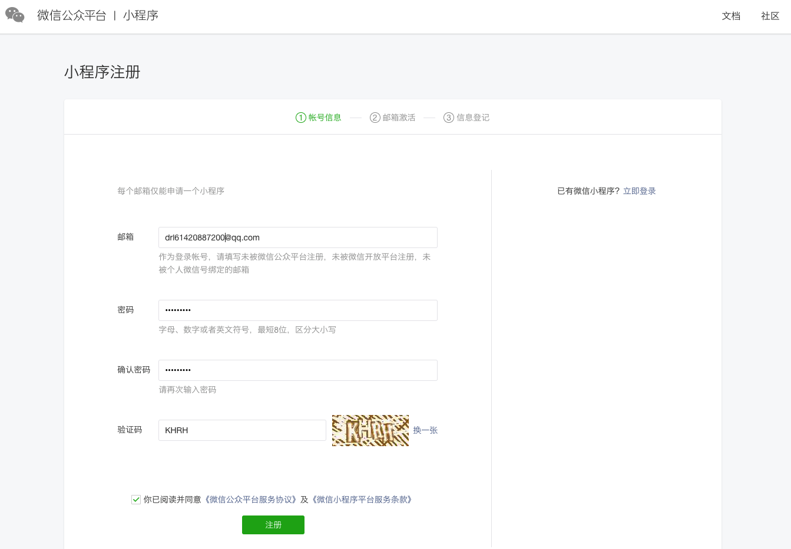
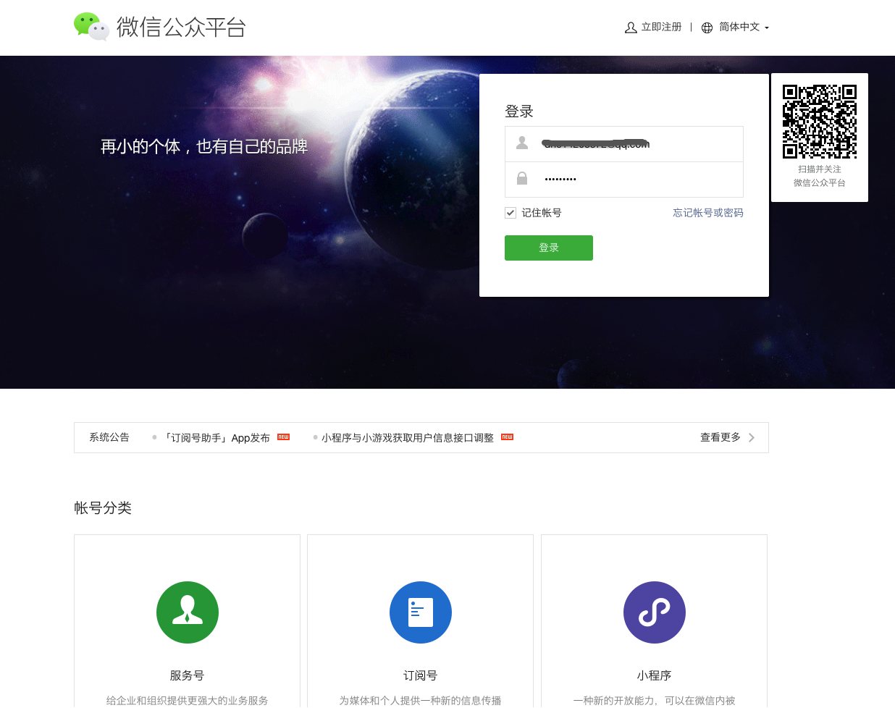
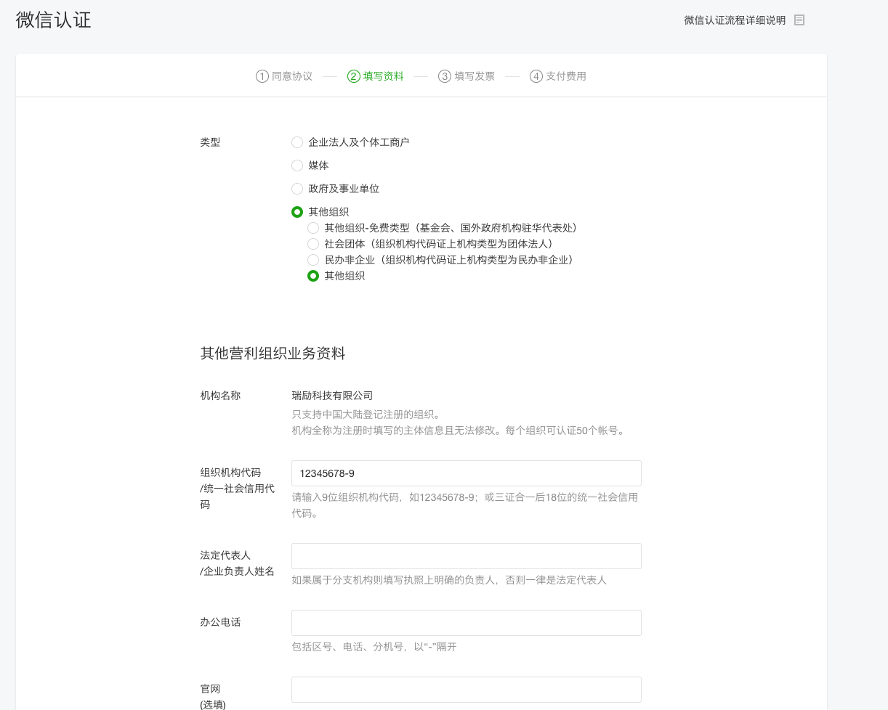
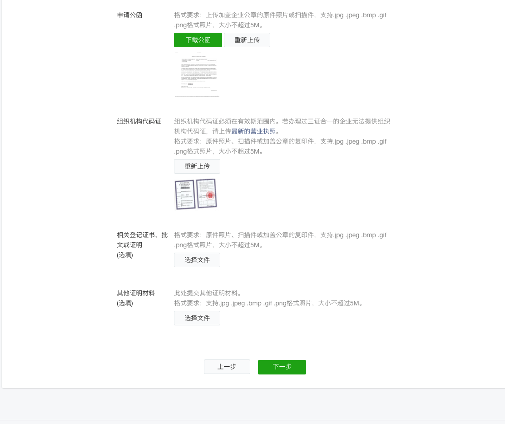
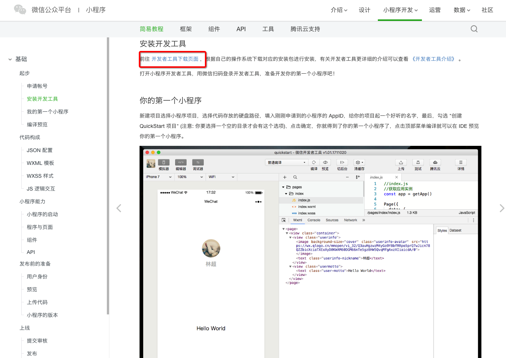
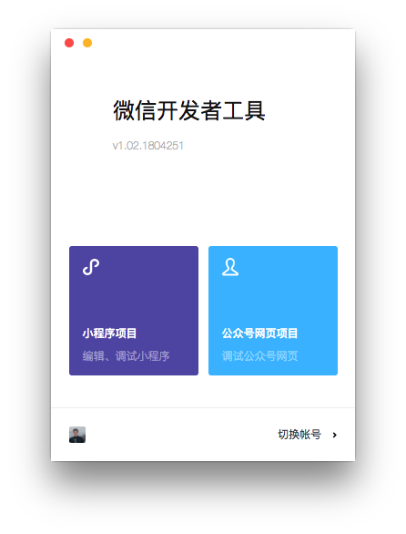
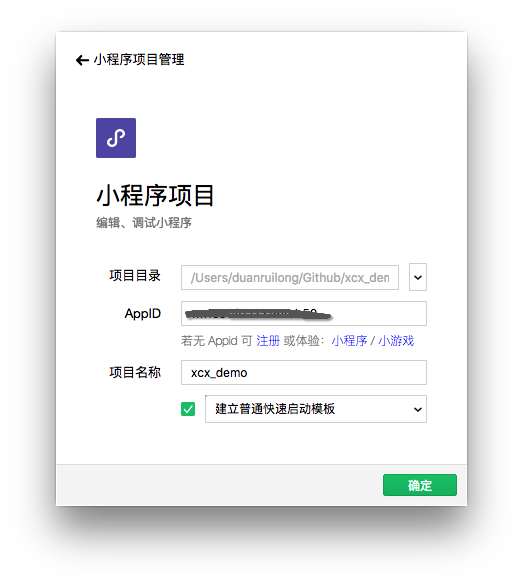
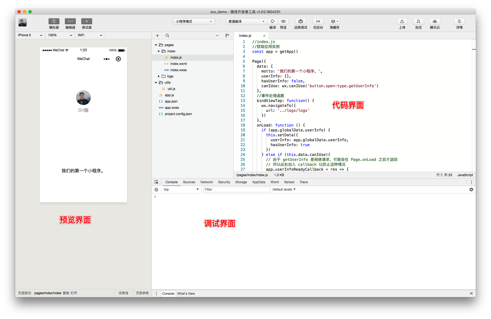

开始小程序的学习打卡，倒腾一门新的技术就要积极参与进去，从搭建初始的开发环境开始，从简单demo开时，逐渐深入，多敲代码，多尝试，多参考，还要自我思考，举一反三。

[小程序开发注册传送门](https://developers.weixin.qq.com/miniprogram/dev/index.html)，按照步骤完成注册认证就可以开始开发咯。

注册完之后就登录进入开发

填写个人资料

填写个人资料

> 注意事项：

* 1.个人信息登记时，组织名称和组织机构代码可随便填，而组织机构代码证，可以直接随便搜一张图片上传即可。

* 2.管理员信息登记，这信息要填写你的真实信息，有身份证实名验证的，还需要开通微信支付的用户，扫码确认才可以继续下一步的信息填写。

* 3.每次登录都需要扫码认证，确认成功后就可以正常登录了。

个人开发只有自己支付注册费用，有公司报销那是再好不过了，之后就是下载开发者工具：

我们扫码登录后会有2个选择:小程序项目和公众号网页项目，我们这里选择第一个小程序项目

新建一个项目文件，输入自己的APPID，确定

进入开发调试界面，界面还是越来越适应开发，真的是越来越兼顾开发与优美界面，开启属于自己的小程序之旅吧！

> 注意事项：

* 1.每次登录都需要扫码登录

* 2.需要输入自己的APPID

* 3.每次修改完代码都要编译

# 总结
是时候开始撸一下微信小程序了，那么好的用户基础，怎么能放弃这么好的一个开发与用户体验的机会。那么，就让我们从申请小程序开始吧！
微信小程序功能非常强大，是IDE和调试界面结合的模式，省去各种浏览器的调试烦恼，还有就是他的轻便与发展前景。